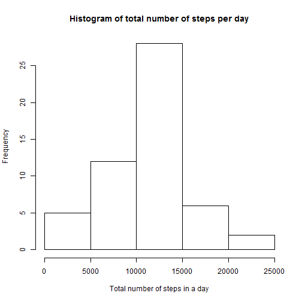

## Download activity.csv to Working Directory C:/AK/Knowledgebase/Data Science/Markdown/assignment/activity.csv

## download the data we need,or check the data exist or not

```r
# load all packages used in this exploratory analysis
library(knitr)
library(dplyr)
library(ggplot2)

setwd("C:/AK/Knowledgebase/Data Science/Markdown/assignment/data")

# load data
data_row <- read.csv('activity.csv')

# remove NA in data
data <- data_row[ with (data_row, { !(is.na(steps)) } ), ]

# print out first 20 rows
head(data,20)
```

```
##     steps      date interval
## 289     0 10/2/2012        0
## 290     0 10/2/2012        5
## 291     0 10/2/2012       10
## 292     0 10/2/2012       15
## 293     0 10/2/2012       20
## 294     0 10/2/2012       25
## 295     0 10/2/2012       30
## 296     0 10/2/2012       35
## 297     0 10/2/2012       40
## 298     0 10/2/2012       45
## 299     0 10/2/2012       50
## 300     0 10/2/2012       55
## 301     0 10/2/2012      100
## 302     0 10/2/2012      105
## 303     0 10/2/2012      110
## 304     0 10/2/2012      115
## 305     0 10/2/2012      120
## 306     0 10/2/2012      125
## 307     0 10/2/2012      130
## 308     0 10/2/2012      135
```
## Question 1

**What is mean total number of steps taken per day?**
For this part of the assignment, you can ignore the missing values in the dataset.

1.Calculate the total number of steps taken per day

2.If you do not understand the difference between a histogram and a barplot, research the difference between them. Make a histogram of the total number of steps taken each day

3.Calculate and report the mean and median of the total number of steps taken per day


```r
by_day <- group_by(data, date)
steps_by_day <- summarise(by_day, total = sum(steps))
steps_by_day
```

```
## # A tibble: 53 × 2
##          date total
##        <fctr> <int>
## 1  10/10/2012  9900
## 2  10/11/2012 10304
## 3  10/12/2012 17382
## 4  10/13/2012 12426
## 5  10/14/2012 15098
## 6  10/15/2012 10139
## 7  10/16/2012 15084
## 8  10/17/2012 13452
## 9  10/18/2012 10056
## 10 10/19/2012 11829
## # ... with 43 more rows
```

```r
hist(steps_by_day$total, main="Histogram of total number of steps per day", 
     xlab="Total number of steps in a day")
```



```r
summary(steps_by_day)
```

```
##          date        total      
##  10/10/2012: 1   Min.   :   41  
##  10/11/2012: 1   1st Qu.: 8841  
##  10/12/2012: 1   Median :10765  
##  10/13/2012: 1   Mean   :10766  
##  10/14/2012: 1   3rd Qu.:13294  
##  10/15/2012: 1   Max.   :21194  
##  (Other)   :47
```

## Question 2
**What is the average daily activity pattern?**
Make a time series plot (i.e. type = "l") of the 5-minute interval (x-axis) and the average number of steps taken, averaged across all days (y-axis)

Which 5-minute interval, on average across all the days in the dataset, contains the maximum number of steps?


```r
# preprocessing data for plot
steps_by_interval <- aggregate(steps ~ interval, data, mean)

# create a time series plot 
plot(steps_by_interval$interval, steps_by_interval$steps, type='l', 
     main="Average number of steps over all days", xlab="Interval", 
     ylab="Average number of steps")
```


```r
# find row with max of steps
max_steps_row <- which.max(steps_by_interval$steps)

# find interval with this max
steps_by_interval[max_steps_row, ]
```

```
##     interval    steps
## 104      835 206.1698
```


**Imputing missing values**
Note that there are a number of days/intervals where there are missing values (coded as NA). The presence of missing days may introduce bias into some calculations or summaries of the data.

Calculate and report the total number of missing values in the dataset (i.e. the total number of rows with NAs)

Devise a strategy for filling in all of the missing values in the dataset. The strategy does not need to be sophisticated. For example, you could use the mean/median for that day, or the mean for that 5-minute interval, etc.

Create a new dataset that is equal to the original dataset but with the missing data filled in.

Make a histogram of the total number of steps taken each day and Calculate and report the mean and median total number of steps taken per day. Do these values differ from the estimates from the first part of the assignment? What is the impact of imputing missing data on the estimates of the total daily number of steps?


```r
sum(is.na(data_row))
```

```
## [1] 2304
```

Replacing NA's with the mean for that 5-minute interval.
 
 
 ```r
 data_imputed <- data_row 
 for (i in 1:nrow(data_imputed)) { 
  if (is.na(data_imputed$steps[i])) {
    interval_value <- data_imputed$interval[i]
    steps_value <- steps_by_interval[
      steps_by_interval$interval == interval_value,]
    data_imputed$steps[i] <- steps_value$steps
  }
 }
 ```

Created new data set data_no_na which equals to data_row but without NA's. All NA's are replaced with mean of 5-minute interval.


```r
# calculate  total number of steps taken each day
df_imputed_steps_by_day <- aggregate(steps ~ date, data_imputed, sum)
head(df_imputed_steps_by_day)
```

```
##         date    steps
## 1  10/1/2012 10766.19
## 2 10/10/2012  9900.00
## 3 10/11/2012 10304.00
## 4 10/12/2012 17382.00
## 5 10/13/2012 12426.00
## 6 10/14/2012 15098.00
```

```r
hist(df_imputed_steps_by_day$steps, main="Histogram of total number of steps per day (imputed)", 
     xlab="Total number of steps in a day")
```


```r
# get mean and median of imputed data
mean(df_imputed_steps_by_day$steps)
```

```
## [1] 10766.19
```

```r
median(df_imputed_steps_by_day$steps)
```

```
## [1] 10766.19
```

```r
mean(steps_by_day$total)
```

```
## [1] 10766.19
```

```r
median(steps_by_day$total)
```

```
## [1] 10765
```

## Question 3
**Are there differences in activity patterns between weekdays and weekends?**
For this part the weekdays() function may be of some help here. Use the dataset with the filled-in missing values for this part.

Create a new factor variable in the dataset with two levels - "weekday" and "weekend" indicating whether a given date is a weekday or weekend day.

Make a panel plot containing a time series plot (i.e. type = "l") of the 5-minute interval (x-axis) and the average number of steps taken, averaged across all weekday days or weekend days (y-axis). See the README file in the GitHub repository to see an example of what this plot should look like using simulated data.


```r
data_imputed['type_of_day'] <- weekdays(as.Date(data_imputed$date))
data_imputed$type_of_day[data_imputed$type_of_day  %in% c('Saturday','Sunday') ] <- "weekend"
data_imputed$type_of_day[data_imputed$type_of_day != "weekend"] <- "weekday"
# convert type_of_day from character to factor
data_imputed$type_of_day <- as.factor(data_imputed$type_of_day)

# calculate average steps by interval across all days
df_imputed_steps_by_interval <- aggregate(steps ~ interval + type_of_day, data_imputed, mean)

# creat a plot
qplot(interval, 
      steps, 
      data = df_imputed_steps_by_interval, 
      type = 'l', 
      geom=c("line"),
      xlab = "Interval", 
      ylab = "Number of steps", 
      main = "") +
  facet_wrap(~ type_of_day, ncol = 1)
```

```
## Warning: Ignoring unknown parameters: type
```


